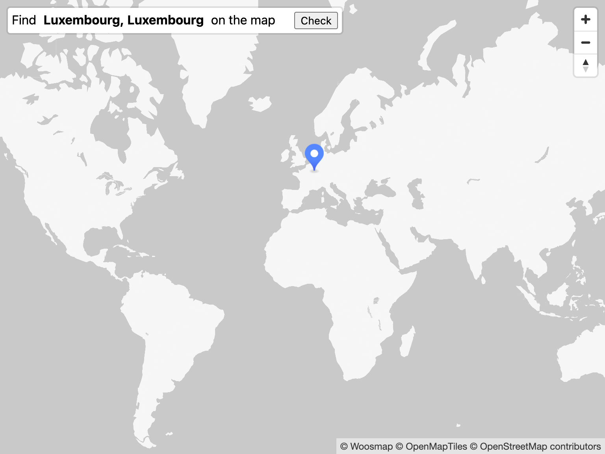

# World Capitals Guesser

Made using HTML + CSS and JS. Enjoy!

## How to play:

Locate given country capitals on a blank map.

Score highly by placing your pin as close to the capital as possible.     
Max score per round: 5000 pts (0 km away)

The game ends when you press "Finish" or when you've gone through all the capitals.

## Demo

[Github pages](https://joshlai09.github.io/world-capitals-guesser/src/index.html)

